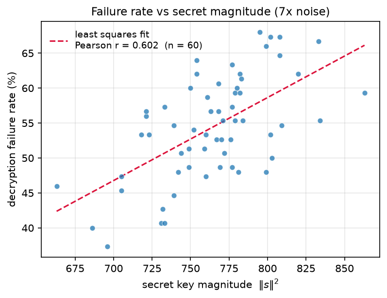
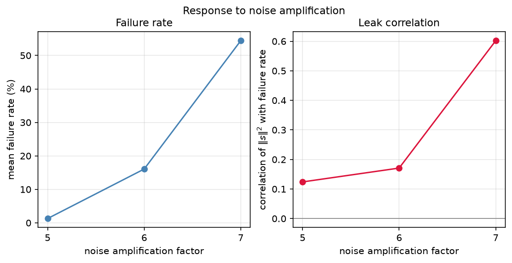
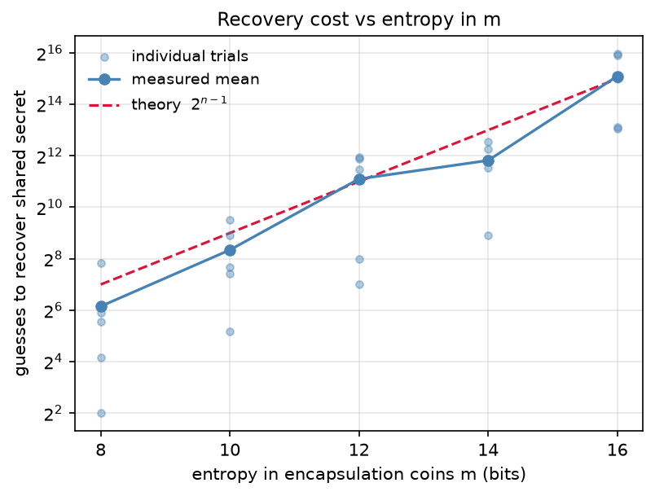
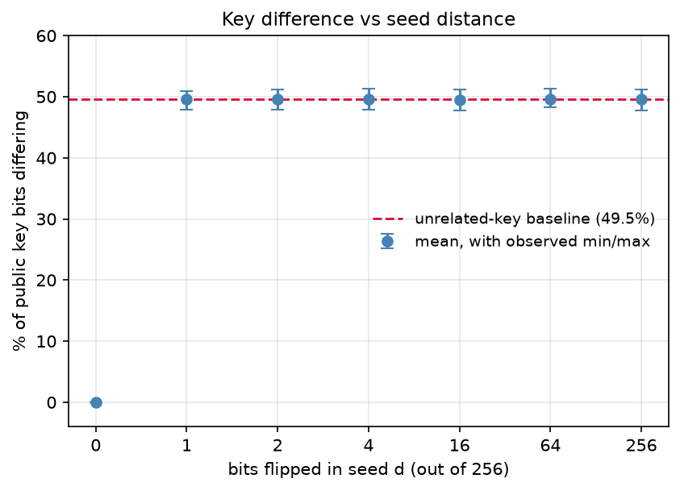

# ML-KEM (NIST FIPS 203) Oracle

A differential testing oracle for ML-KEM (NIST FIPS 203) utilizing three implementations under a seed-controlled interface, plus experiments analyzing how ML-KEM prefroms when randomness fails and noise is increased.

ML-KEM implementations used can be found below:

https://github.com/TheNotEvan/Post-Quantum-Crypto

https://github.com/GiacomoPope/kyber-py/tree/main

https://github.com/mjosaarinen/py-acvp-pqc/tree/main

# Disclamer

This is an educational tool only. Please do not use this in a real world environment. This implementation is in pure python, meaning it is not constant time. Created by a high schooler interested in crpytography and cybersecurity.

# Validation

### ACVP Test Vectors

All three implementations pass the NIST ACVP vectors for FIPS 203, which can be found https://github.com/usnistgov/ACVP-Server#acvp-server, as well as the kat folder. Differentials can also be run to check that all implementations generate the same responses based on random d, z, and m.

#### Run the Vectors

```bash
.venv/Scripts/python.exe -m pytest
```
```python
from oracles.differentials import sweep
from oracles.mine import MineOracle
from oracles.saarinen import SaarinenOracle
from oracles.kyberpy import KyberPyOracle

o=[C('ML-KEM-768') for C in (MineOracle,SaarinenOracle,KyberPyOracle)]
print(len(sweep(o,50)),'divergences in 50 trials')
```

# Experiments

### Decrytion failures leak the secret key

**r = 0.602, n = 60, p < 0.0001**

Amplifying the error terms by 7x brings significant correlation, with over 50% of operations failing decryption. As terms are amplified, they get closer to the rounding boundary, which causes decryption to fail more often (Note: in a real ML-KEM implementation, failure rate is 2^-164)




### Weak encapsulation coins give up the session key

Because the recovery cost is 2^(n-1), if there are less than 20 bits of enthropy when generating randomness when running a python program, message m can be recovered in realistic time. 



### No partial-overlap amplifier

Flipping even a single bit of a keygen seed results in the corresponding public key being ~49.5% different in bits, which is statistically indistinguishable.




# Setup

```bash
pip install -r requirements.txt
```

```bash
export MLKEM_PY_ACVP_PQC=/path/to/py-acvp-pqc
export MLKEM_POST_QUANTUM_CRYPTO=/path/to/Post-Quantum-Crypto
```
Run Pytest:

```bash
python -m pytest
```

Run experiments (Note that the seed is set to 1234, you can change it in the code)

```bash
python -m experiments.failure_correlation
```

```bash
python -m experiments.avalanche_d
```

```bash
python -m experiments.recover_m
```

Regenerate every figure from the saved CSVs:

```bash
python -m experiments.plots
```

# Attribution

NIST ACVP vectors from [usnistgov/ACVP-Server](https://github.com/usnistgov/ACVP-Server).
Reference implementations by Markku-Juhani Saarinen and Giacomo Pope.
